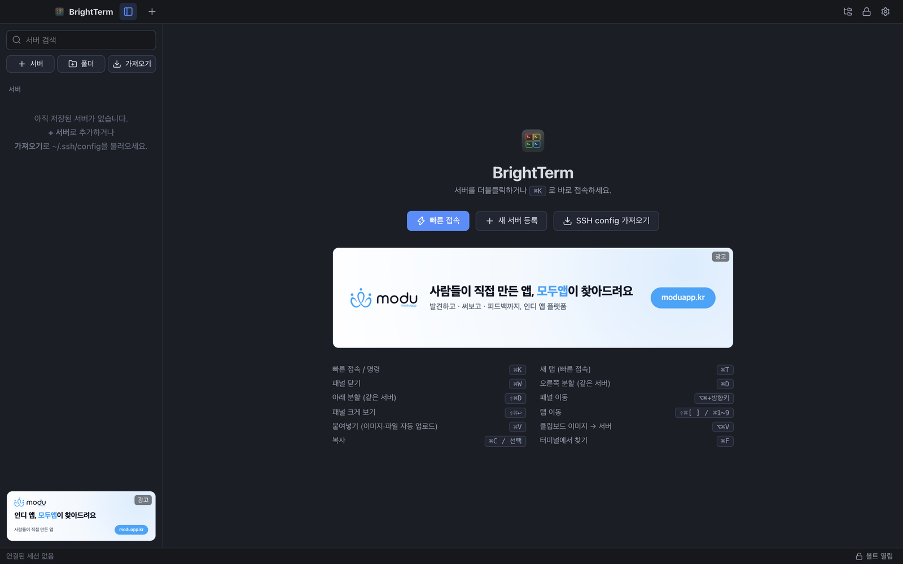

# BrightTerm

PuTTY를 대신할 **Windows·macOS용 SSH / Telnet / 시리얼 터미널**입니다. 서버를 10대 넘게 동시에 띄워도 어느 창이 어느 서버인지 바로 알아볼 수 있게 만드는 것이 목표입니다.



- 서버 계정은 내 PC에만 암호화해 저장합니다. 별도 서버·회원가입이 없습니다.
- AWS EC2 인스턴스를 불러와 배스천(점프 호스트) 경유 접속까지 자동으로 설정합니다.
- 캡처 이미지를 붙여넣으면 서버로 올리고 경로를 입력해 줍니다. 서버에서 Claude Code 같은 CLI를 쓸 때 편합니다.

## 설치

**[최신 버전 내려받기 → Releases](https://github.com/Yeosup/BrightTerm/releases/latest)**

| 운영체제 | 파일 | 비고 |
| --- | --- | --- |
| Windows | `BrightTerm-Setup-1.0.0.exe` | 설치형. 설치 경로 선택, 바탕화면 바로가기 |
| Windows | `BrightTerm-Portable-1.0.0.exe` | 설치 없이 실행 |
| macOS (Apple Silicon) | `BrightTerm-1.0.0-mac-arm64.dmg` | M1 이후 맥 |
| macOS (Intel) | `BrightTerm-1.0.0-mac-x64.dmg` | Intel 맥 |

- **Windows**: "Windows의 PC 보호" 창이 뜨면 `추가 정보 → 실행`을 누르세요(코드 서명 전 빌드).
- **macOS**: dmg에서 앱을 응용 프로그램 폴더로 끌어 넣은 뒤, 처음 한 번은 앱을 **우클릭 → 열기** 하세요. 처음 사내망(192.168.x.x 등) 서버에 접속할 때 **로컬 네트워크 접근**을 물으면 `허용`을 누르세요. 거부했다면 `시스템 설정 → 개인정보 보호 및 보안 → 로컬 네트워크`에서 켤 수 있습니다.

처음 실행하면 **마스터 비밀번호**를 정합니다. 서버 비밀번호와 키는 이 비밀번호로 암호화되어 이 PC에만 저장됩니다. 이때 나오는 **복구 코드 24자리**는 꼭 따로 보관하세요. 마스터 비밀번호를 잊으면 이 코드로만 복구할 수 있습니다.

### Windows ↔ macOS 옮기기

쓰던 PC에서 `설정 → 백업 → 백업 내보내기`로 만든 `.btbackup` 파일을 새 PC에서 `백업 가져오기` 하면 서버 목록·저장된 비밀번호·설정이 그대로 옮겨집니다. 같은 마스터 비밀번호로 열립니다. (OS 계정 잠금 해제 설정은 옮겨지지 않으니 새 PC에서 다시 켜세요.)

## 주요 기능

| 기능 | 사용법 |
| --- | --- |
| 서버 가져오기 | `가져오기` 버튼. **PuTTY 세션**(Windows 레지스트리, macOS `~/.putty/sessions`)과 **`~/.ssh/config`**를 읽습니다. 호스트·포트·사용자·키·포트 포워딩(`LocalForward`/`RemoteForward`)·점프 호스트(`ProxyJump`)·시리얼·인코딩이 옮겨집니다. 처음 실행할 때 자동으로 제안합니다. |
| AWS EC2 가져오기 | `가져오기 → AWS EC2 불러오기`. 설치된 **aws CLI의 자격 증명**(`aws configure`)으로 모든 리전의 인스턴스를 읽습니다. 공인 IP가 없는 서버는 같은 VPC의 배스천(이름 앞부분이 같은 것 우선, 예: `shop-app` → `shop-bastion`)을 점프 호스트로 자동 연결합니다. 접속 계정은 AMI로 고르고(ubuntu/ec2-user 등), 키는 `~/.ssh/<키 페어 이름>.pem`에서 찾아 볼트에 넣습니다. |
| 점프 호스트 (배스천 경유) | 서버 편집 → 고급 → 점프 호스트에서 먼저 거쳐 갈 서버를 고릅니다. 여러 단계도 됩니다. |
| 포트 포워딩 (터널링) | 서버 편집 → 고급 → 포트 포워딩. **L**(로컬: 내 PC 포트 → 서버 쪽 주소)과 **R**(원격: 서버 포트 → 내 PC 쪽 주소). 접속해 있는 동안 유지됩니다. 예: `L 127.0.0.1:9090 → 127.0.0.1:9090` 후 브라우저에서 `https://localhost:9090` |
| ID/PW 저장 | 서버 편집 → 인증 탭에서 입력합니다. 또는 접속할 때 묻는 창에서 "저장"을 체크하세요. 여러 서버가 한 계정을 쓰면 "공유 계정"으로 묶을 수 있습니다. |
| 창 구분 | 서버·폴더마다 환경(운영/스테이징/개발/장비)과 색을 지정합니다. 탭, 패널 머리글, 트리, 워터마크가 그 색을 따르고, 선택된 패널은 머리글 아래 색 선으로 표시됩니다(운영 서버는 빨강). |
| 화면 분할 | 같은 서버를 오른쪽/아래로 나눠 엽니다. 폴더를 우클릭한 뒤 "폴더 전체를 그리드로 열기"를 누르면 폴더의 서버가 한 화면 격자로 열립니다. |
| 빠른 접속 | 서버 이름이나 IP를 검색하거나 `user@host:port`를 바로 입력합니다. `>`로 시작하면 명령을 실행합니다. |
| 이미지 전송 (Claude Code 등) | SSH 터미널에서 캡처를 붙여넣으면 서버 `~/.brightterm/uploads/`에 PNG로 올라가고 그 경로가 입력됩니다. 파일을 터미널에 끌어다 놓아도 같습니다. |
| SFTP | 같은 연결로 파일 패널이 열립니다(재로그인 없음). 끌어다 놓아 업로드하고, 우클릭으로 다운로드·삭제·권한·이름 변경을 합니다. 이미지 미리보기와 "로컬 앱으로 편집"(저장하면 자동 업로드)도 있습니다. |
| 동시 입력 | 한 탭의 모든 패널에 같은 명령을 입력합니다. |
| 운영 서버 보호 | 운영 서버에서 `rm -rf`, `reboot`, `DROP TABLE` 같은 명령을 실행하거나 붙여넣으면 확인 창을 띄웁니다. 여러 줄을 붙여넣을 때도 확인합니다. |
| 자동 재접속 | 연결이 끊기면 2·4·8…초 간격으로 다시 연결합니다. 끊긴 창에서 Enter를 누르면 바로 재접속합니다. |
| 시리얼 (RS-485/USB) | 프로토콜에서 "시리얼"을 고릅니다. Windows는 `COM3`, macOS는 `/dev/cu.usbserial-…` 형식입니다. baud, 패리티, 흐름 제어, Enter 전송값(CR/LF/CRLF), 로컬 에코를 설정할 수 있습니다. |
| 잠금 해제 | 마스터 비밀번호 대신 **Windows 계정** 또는 **macOS Touch ID(키체인)**으로 열 수 있습니다(설정 → 보안). |
| 기타 | EUC-KR(CP949) 장비, 스니펫, 세션 로그, 자동 잠금, 백업 내보내기/가져오기 |

## 단축키

macOS에서는 앱 단축키가 모두 **⌘** 에 있어서 Ctrl+C/K/U/V/W 같은 Ctrl 조합은 전부 셸로 그대로 갑니다.

| 동작 | Windows | macOS |
| --- | --- | --- |
| 빠른 접속 / 새 연결 | Ctrl+K, Ctrl+Shift+T | ⌘K, ⌘T |
| 탭(패널) 닫기 | Ctrl+Shift+W | ⌘W |
| 오른쪽 / 아래 분할 | Ctrl+Shift+D / Ctrl+Shift+E | ⌘D / ⇧⌘D |
| 패널 이동 | Alt+방향키 | ⌥⌘+방향키 |
| 패널 크게 보기 | Ctrl+Shift+Enter | ⇧⌘↩ |
| 탭 이동 | Ctrl+Tab, Ctrl+1~9 | ⇧⌘[ ], Ctrl+Tab, ⌘1~9 |
| 복사 | 드래그 선택, Ctrl+Shift+C, 선택 후 Ctrl+C | 드래그 선택, ⌘C |
| 붙여넣기 (이미지·파일 자동 업로드) | Ctrl+V, 우클릭 | ⌘V, 우클릭 |
| 클립보드 이미지 강제 업로드 | Ctrl+Alt+V | ⌥⌘V |
| 찾기 | Ctrl+Shift+F | ⌘F |
| SFTP 패널 | Ctrl+Shift+S | ⇧⌘S |
| 동시 입력 | Ctrl+Shift+B | ⇧⌘B |
| 서버 목록 숨기기 | Ctrl+Shift+L | ⇧⌘L |
| 글자 크기 | Ctrl+휠, Ctrl+= / Ctrl+- / Ctrl+0 | ⌘= / ⌘- / ⌘0, 트랙패드 핀치 |
| 설정 / 전체 화면 | — / F11 | ⌘, / ⌃⌘F |

Windows에서 `vim` 등에 Ctrl+V를 보내야 한다면 설정 → 입력에서 "Ctrl+V로 붙여넣기"를 끄세요. 그러면 붙여넣기는 Ctrl+Shift+V로 합니다.

## 보안 구조

- 마스터 비밀번호는 scrypt(N=2^17)로 키 암호화 키가 됩니다. 이 키로 무작위 256비트 볼트 키를 AES-256-GCM으로 감쌉니다. 각 계정은 그 볼트 키로 AES-256-GCM 암호화됩니다.
- 볼트 파일: Windows `%APPDATA%\BrightTerm\data\vault.json`, macOS `~/Library/Application Support/BrightTerm/data/vault.json`. 서버 목록은 같은 폴더의 `store.json`에 있습니다.
- 처음 접속하는 서버는 호스트 키 지문을 보여 주고 승인을 받습니다. 키가 바뀌면 빨간 경고와 함께 접속을 막습니다.
- 복호화된 비밀번호는 화면(렌더러) 쪽으로 넘어가지 않습니다. 렌더러는 Node 접근이 없고 context isolation이 켜져 있습니다.
- 앱이 스스로 보내는 네트워크 요청은 **배너 목록 가져오기**뿐이며 서버 목록·IP·계정 등 어떤 정보도 담지 않습니다(아래 참고).

## 배너

환영 화면과 서버 목록 아래에 배너가 하나씩 표시됩니다(`광고` 표시). 터미널 작업 영역에는 넣지 않습니다.

- 앱에 기본 배너가 들어 있어 오프라인·사내망에서도 그대로 보입니다.
- 원격 목록은 이 저장소의 [`banners/feed.json`](./banners/feed.json)입니다. 이 파일을 고쳐 push 하면 앱을 다시 배포하지 않아도 배너가 바뀝니다. 앱은 시작할 때 한 번 받아 캐시합니다(다른 주소를 쓰려면 `BRIGHTTERM_BANNER_FEED` 환경 변수, 빈 값이면 끔). 실패하면 캐시 → 기본 배너 순으로 조용히 넘어갑니다.
- 목록 형식:

```json
{
  "banners": [
    {
      "id": "moduapp-2026q4",
      "slot": "welcome",
      "image": "https://example.com/banner-wide.png",
      "link": "https://moduapp.kr/?utm_source=brightterm&utm_medium=app_banner",
      "alt": "모두의 앱",
      "weight": 1,
      "start": "2026-10-01",
      "end": "2026-12-31"
    }
  ]
}
```

- `slot`: `welcome`(권장 1280×320) 또는 `sidebar`(권장 720×240). 이미지는 png/jpeg/webp/gif, 768KB 이하, **https만**. 링크도 https만 받고 외부 브라우저로 엽니다. HTML·스크립트는 받지 않습니다.

## 개발

```bash
npm install
npm run dev          # 개발 실행
npm run build        # 빌드
npm run typecheck
npm run dist:win     # Windows 설치형 + 포터블 (dist/)
npm run dist:mac     # macOS dmg x64 + arm64 (dist/) — ad-hoc 서명
```

- 구조: `src/main`(Electron 메인: SSH/시리얼/텔넷, 볼트, SFTP, 가져오기, AWS, 배너), `src/preload`, `src/renderer`(React + xterm.js UI, 키 판정은 `platform.ts`), `src/shared`(공용 타입).
- 테스트: `test/e2e.mjs`(Linux sshd 시나리오), `test/e2e-mac.mjs`(macOS 키 모델·붙여넣기·이미지 업로드 — 파일 머리 주석 참고), `test/importers.test.mjs`(가져오기 파서).
- 요구 사항: Node 20+, Electron 43.

## 라이선스

[MIT](./LICENSE) — 누구나 자유롭게 쓰고, 고치고, 배포할 수 있습니다.
